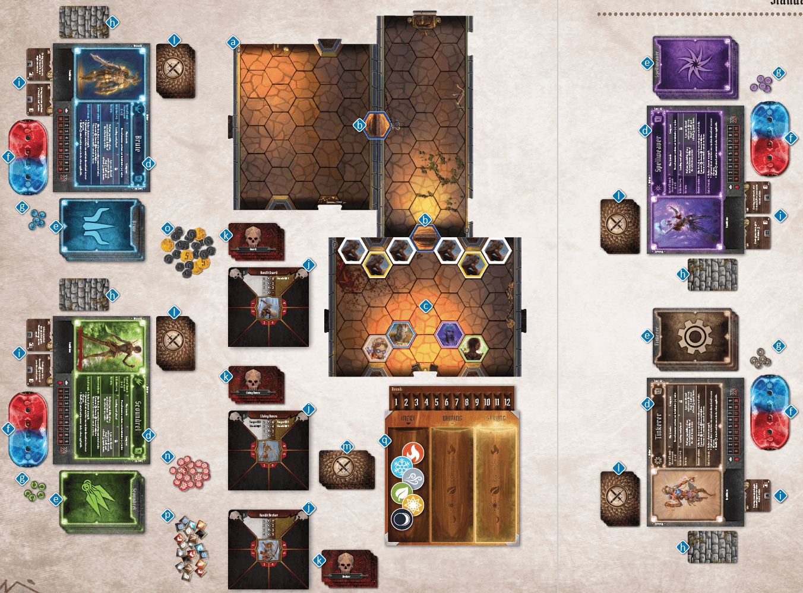
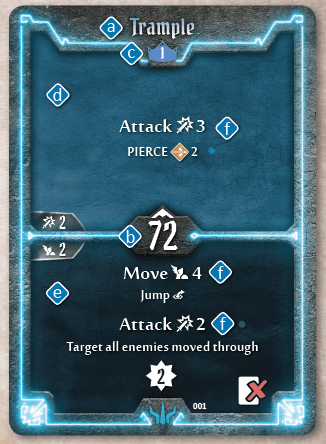
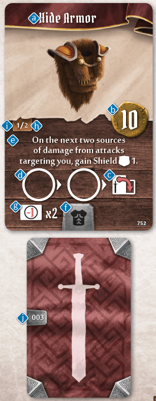
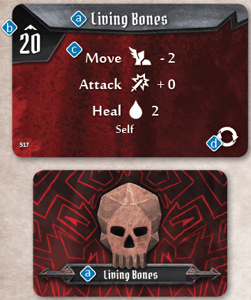
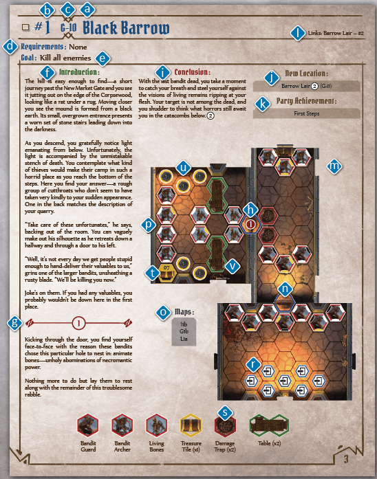
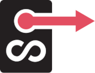
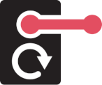

# Gloomhaven Rule Book
An inofficial light-weight, searchable copy of the rule book.

---
**
Pages 4 and 5
**

---

# Play Overview

The following section will teach you the mechanics for playing through an individual scenario, using the first one in the Scenario Book, **Black Barrow**, as an example.

**Standard Attack Modifier Deck**

### THE PLAY AREA INCLUDES:

- A modular board of map tiles (a), constructed in a specific configuration using the Scenario Book as a reference (see Scenario Setup on pp. 12–13 for details). The map tiles should be laid out with doors (b) connecting them. The configuration of overlay tiles and monsters for the first room (c) should also be set up along with the character figures.
- A character mat for each player (d) and the corresponding hand of ability cards for that character’s class (e), health and experience trackers (f), character tokens (g), a facedown battle goal card (h), and any equipped item cards (i).
- All monster statistic cards (j), with their corresponding standees, and monster ability cards (k) set to one side in individual shuffled decks.
- Shuffled decks of attack modifier cards for each player (l) and one for the monsters (m). **A standard attack modifier deck consists of twenty cards as shown at the top of the page**, not the characterspecific modifier cards found in the character boxes. A deck, however, may be modified by level-up bonuses, items, scenario effects, and the effects of the CURSE and BLESS conditions.
- Piles of damage tokens (n), money tokens (o), and condition tokens (p).
- The elemental infusion table (q) with all six elements set in the “Inert” column.

---
**
Page 6
**

---

## Character Mats

When a player begins their journey with the game, he or she will select one of the available character classes to play. Only one copy of each character class can be played in any given scenario. Each class has a unique set of abilities, so this is an important decision to make. When the box is first opened, the Brute , Tinkerer , Spellweaver , Scoundrel , Cragheart , and Mindthief  are available.

Once a character class has been chosen, the player takes the corresponding character mat, character tokens, and that character’s starting hand of Level 1 ability cards from the larger tuck box containing the character’s symbol, as well as the miniature contained in the smaller character tuck box.

### A CHARACTER MAT INCLUDES:

- A portrait (a), icon (b), and name (c) of the class.
- Indicators of the maximum hit points at each level (d) of the class. Players should use tracking dials (e) to track their hit points (f) and experience (g) during a scenario.
- The maximum number of ability cards the class can take into battle (h).
- A short reference (i) for the round structure.
- Designations along the border (j) for where to place **discarded**, **lost**, and **active** cards.
- The reference number of the event cards (k) added to each deck when the character class is unlocked (not present on the six starting classes) and of event cards (l) added the first time the character class retires (see Announcing Retirement on p. 48 for details). These reference numbers apply to both city and road event decks.

---
**
Page 7
**

---

## Character Ability Cards

Playing ability cards is what allows a character to perform **actions** in a scenario. Each round players choose two ability cards and use the **top action** of one card and the **bottom action** of the other card, resulting in two **actions** for each player on his or her turn. All ability cards are specific to a character class and are acquired when starting a new character or by leveling up.

### AN ABILITY CARD INCLUDES:

- The name of the ability (a).
- An initiative number (b). The initiative number of the leading card played determines a player’s order in the initiative of a given round (see Determining Initiative on p. 18 for more details).
- The level of the class card (c). A character starting at Level 1 can only use their Level 1 cards (or, alternately, Level X cards), but a character gains more powerful cards as they level up to add to their pool of available ability cards.
- A top action (d) and bottom action (e). When the two ability cards are played on a player’s turn, one is used for the top action and the other for the bottom action. Note that a single **action** can contain several separate **abilities** (f). (See Character Turn on pp. 18–28 for more details on character actions.)

---
**
Page 8
**

---

## Item Cards

Item cards are acquired by spending gold in between scenarios or looting specific treasure tiles. All item cards a character equips will be placed below his or her character mat and can be used during a battle to augment his or her abilities. Item cards are not class-specific, so any character can use any item. However, characters are limited in the number of items they can **equip** (bring into a scenario). Each character can equip only one  item, one  item, one  item, up to two  items **OR** one  item, and up to a number of  equal to half their level, rounded up. **Characters cannot own more than one copy of any item card.**

 |  |  |  |  | 
-----|------|------|----------|-----------|-----------
Head | Body | Legs | One Hand | Two Hands | Small Item

### AN ITEM CARD INCLUDES:

- The name of the item (a) and the amount of gold a character must pay to acquire the item from the shop (b).
- What happens to the card after it is used (c). 
  - This symbol  means the item is **spent** after use, which is denoted by rotating the card to its side. Spent cards can be refreshed when a character performs a long rest (see Resting on p. 17 for more details). Sometimes an item is used multiple times before it is spent or consumed. This is depicted by use slots (d) on the card and can be tracked using a character token. 
  - This symbol  (not pictured) means the item is **consumed** after use, which is shown by flipping the card facedown. Consumed cards can only be refreshed **during a scenario** by specific abilities. **All items are refreshed between scenarios.** No item can be permanently consumed. 
  - If a card depicts neither of these symbols, there are no restrictions on the number of times it can be used during a scenario, other than what is written in the text of the card.
- When the item can be used and the bonus gained by the character when the item card is used (e).
- The equip slot (Head, Body, Legs, One Hand, Two Hands, Small Item) the item occupies (f).
- Some equipped items add a number of  cards to the equipping character’s attack modifier deck at the start of a scenario. If this is the case, the number of modifier cards is specified on the item (g).
- A count of how many of this item are in the game (h) and where this card lies within that count (i).
- Reference number for the item (j), which is on the back of the card.

---
**
Page 9
**

---

## Monster Statistics Cards

Monster statistic cards give easy access to the base statistics of a given monster type for both its normal and elite variants. A monster’s base statistics will vary depending on the **scenario level** (see Scenario Level on p. 15 for details). Each edge of the cards, on both sides, reflects the statistics for a given scenario level. Rotate or flip the card to show the required level.

A monster stat sleeve should be used to track damage and condition tokens and to hide the unneeded information for other unused levels.

### A MONSTER STATISTIC CARD INCLUDES:

- The monster’s name (a) and level of the statistic set (b) corresponding to the scenario level.
- Sections for normal (c) and elite (d) versions of this monster.
- A monster’s **hit point** value (e), which is the amount of damage that needs to be inflicted on the monster before it dies.
- A monster’s **movement** value (f), the base number of hexes a monster can move with a **Move** action.
- A monster’s **attack** value (g), the base amount of damage the monster does with an **Attack** action.
- A monster’s **range** value (h), which is the base number of hexes away from the monster’s own hex that the monster can reach with an attack or a heal. A “–” as the range value signifies the monster’s normal **Attack** action can only target adjacent hexes (i.e., a **melee** attack).
- Any special traits this monster type possesses (i). These traits are permanent and persist from round to round. These traits may include Flying, which is symbolized by  (j) next to the monster’s name (see Move on p. 19 for details).

---
**
Page 10
**

---

## Monster Ability Cards

Each round, after players have selected their own ability cards, one card is played for each monster type currently on the board from their respective decks of monster ability cards. These cards determine which abilities each monster of that type—both normal and elite—will perform during the round on its turn.

### A MONSTER ABILITY CARD INCLUDES:

- The name of the monster type (a). Sometimes, multiple monster types use the same, more generic ability deck. For instance, Bandit Guards, City Guards, and Inox Guards all use the same “Guard” deck.
- An initiative number (b). This number will determine when every monster of that type will act in a given round (see Determining Initiative on p. 18 for details).
- A list of abilities (c). A monster will perform each of these abilities in the order listed (if possible) and then end its turn (see Monster Turn on pp. 29–32 for details).
- A shuffle symbol (d). If this symbol appears on a card, shuffle the corresponding monster’s ability discard pile back into the draw deck at the end of the round.

## Battle Goal Cards

**At the beginning of every scenario, each character receives two battle goal cards in secret and chooses one to keep, discarding the other.** If the scenario is successfully completed and the character meets the criteria of the chosen card (a), he or she will earn a number of **checkmarks** as specified on the bottom of the card (b). Checkmarks are used to enhance a player’s attack modifier deck (see Additional Perks on p. 44 for details). If the scenario resulted in failure, the character receives nothing from his or her battle goal card, regardless of whether the goal was achieved. Players can keep track of their battle goal progress using notes if necessary. Players should keep their battle goals secret from one another until the scenario is over.

---
**
Page 11
**

---

## Attack Modifier Cards

Any time an **Attack** ability is performed, a separate attack modifier card is drawn for **each individual target** of the attack. Players draw from the personal attack modifier deck for their chosen character and monsters draw from a collective monster deck. The modifier listed on the card is then applied to the attack, possibly reducing or increasing its numerical value.

### AN ATTACK MODIFIER CARD INCLUDES:

The value of the modifier for the attack (a). A “Null” symbol (b) means that no damage is done by the attack. A “2x” symbol (c) means the attack value is doubled.

Conditions, elemental infusions, or other special effects of the attack (d). If the attack modifier of the card is +0, the special effect is shown in the center circle of the card (e). Otherwise, it is shown to the left of the modifier value (f). When these special effects are activated, they function exactly as if they had been written on the action card being used for the attack.

A rolling modifier symbol (g) indicates that an additional modifier card should be drawn. Modifier cards are then drawn until a rolling modifier is **not** revealed, at which point all the drawn modifiers are added together.

  
*Add “PUSH 2” and the earth element effects to your attack, then increase y our attack value by 2.*

A special BLESS (h) or CURSE (i) border. If a BLESS or CURSE card is drawn, it should be **removed** from the player’s deck instead of being placed into the discard. Curse cards also have either a  or an  to denote whether they can be placed in the monster attack modifier deck , or a character's attack modifier deck .

A shuffle symbol (j). At the end of the round in which a “Null”  or “2x”  card is drawn from a deck, players will shuffle all the played modifier cards back into that particular draw deck. This shuffling also happens if a modifier card must be drawn and there are none left in the draw pile.

A type icon (k). All standard attack modifier decks have a 1, 2, 3, 4, or M icon (l) for easy sorting, such that all cards with a given icon form the standard 20-card deck. All cards a character class adds to their modifier decks through perks (see Leveling Up on pp. 44–45 for details) have the symbol of that character class (m). Cards added to a modifier deck by a scenario or item effect have a  icon (n). These cards should be removed at the end of a scenario.

---
**
Page 12
**

---

# Scenario Setup

When setting up a new scenario, the first step is to look in the scenario book to set up the map tiles and prepare all the monster types you will be fighting. Then read the introduction text and apply any negative scenario effects from the “Special Rules” section. Next, two battle goals should be dealt to each player, one of which will be discarded. Players can then decide which items they would like to equip from the collection of items they own (adding in -1 cards to their attack modifier decks when applicable). Next, players should decide which ability cards they would like to put in their hand, choosing from the pool of those available to them. A player must select a number of cards equal to his or her character’s hand size. When first starting the game, a player’s hand should only consist of the set of **Level 1** ability cards for the character’s class. Once a player has become familiar with the class, he or she can begin substituting out Level 1 cards for the more complex cards with **X** as the level. Once the character begins to level up, he or she will also get access to higher level cards to add to his or her hand by pulling others out. After players select their hand, any effects of a preceding road event or city event are applied (see Traveling and Road Events on p. 41 for details).

## Scenario Page

- The name (a), reference number (b), and grid location (c) of the scenario with completion check box.
- Any achievements (d) required to play the scenario in a campaign.
- The victory conditions (e).
- When playing the scenario as part of a campaign, the page provides introductory text (f), additional story points (g) that are read when entering the corresponding hex on the board (h), and concluding text (i) to be read when the victory condition is met.
- The name, reference number, and grid location of any new scenario locations (j) unlocked by completing the scenario within a campaign.
- Any other rewards (k) earned by completing the scenario when in a campaign.

---
**
Page 13
**

---

- Any locations the scenario links to ((l); see Traveling and Road Events on pp. 41–42 for details).
- The configuration of map tiles (m) and door tiles (n) to be placed during setup. The specific map tiles needed for each scenario are also given (o). Each scenario map is broken up into separate rooms by door overlay tiles. A room may contain more than one map tile if those tiles are connected by other overlay tiles.
-  Indications used to populate the scenario map based on the monster key . These indications may be in one of two different orientations depending on the overall orientation of the map. Monster placement is indicated in a symbol’s upper left for two characters, upper right for three characters and bottom for four characters. **BLACK** means the monster is not present, **WHITE** means a normal monster is present, and **GOLD** means an elite monster is present. Normal monsters should be placed on the map with their corresponding standees in white bases, and elite monsters should be placed in gold bases. Example: / indicates which type of monster is placed on this hex, and in this case no monster is placed in for two characters, a normal monster is placed for three characters, and an elite monster is placed for four characters. 

  ***Example:**  indicates which type of monster is placed on this hex, and in this case no monster is placed in for two characters, a normal monster is placed for three characters, and an elite monster is placed for four characters.*

  **Note that only monsters in the starting room are placed at the beginning of a scenario. Monster standees each have a number to determine the order in which they act during the turn (see Order of Action on p. 29 for details). The standee numbers should be randomized when placed.**
  
- The available starting character locations, depicted by  (r) . Players can choose to place their figures on any empty  hex at the start of the scenario.
- The type of traps used in this scenario (s) and the reward for looting any treasure tiles on the board (t). The numbers for the treasures are referenced in the back of the Scenario Book, so that rewards are kept secret.
- Locations of money tokens (u) and overlay tiles (v) to be placed on the map when the room tile is revealed.

---
**
Page 14
**

---

## Overlay Tiles

A scenario is constructed from a set of map tiles as instructed in the Scenario Book. Additionally, there will be special overlay tiles to fill out the encounter.

### TYPES OF OVERLAY TILES:

- **Doors** . A door acts as a separation between two rooms. When a character moves onto a closed door tile, they immediately flip over the door tile to the open side, revealing the adjacent room tile. Immediately place overlay tiles, monsters, and money tokens as indicated in the scenario description for the revealed room. While closed doors do not hinder character movement at all, they act as a wall for any monsters or character-summoned figures, and figures cannot be forced through a closed door. Open doors do not hinder any movement and cannot be closed. Door art varies by environment type, but they all function exactly the same.
- **Corridors** . A corridor is placed on the connection of two map tiles to cover the walls and create a single room out of multiple map tiles. Corridors act like normal empty hexes.
- **Traps** . A trap is sprung when a figure enters its hex with normal or forced movement. Flying  and Jump  movements are unaffected by traps. When a trap is sprung, it inflicts some negative effect on the figure who sprung it and then it is **removed from the board**. A trap can also be disarmed through specific actions to remove it from the board without suffering its negative effects. Trap effects are varied and are specified in the Scenario Book. If part of a trap’s effect is listed as “damage,” the trap will inflict **2+L damage** on the affected figure, where L is the **scenario level**. Characters and monsters can also create traps on the board, with the effects specified by the ability that creates the trap. Whenever a trap is placed on the board, tokens for the damage and effects the trap applies should be placed on top of the trap tile for easy reference.
- **Hazardous terrain** . If a figure enters a hex with hazardous terrain via normal or forced movement, each hex will inflict half the damage of a trap (rounded down). Flying  and Jump  movements are unaffected by hazardous terrain. Unlike traps, hazardous terrain does not get removed after its effect is applied, but instead remains on the board indefinitely. Starting a turn on or exiting these hexes does not cause additional damage.
- **Difficult terrain** . It takes a figure two normal movement points to enter a hex with difficult terrain. Flying , Jump , and forced movements are unaffected by difficult terrain.
- **Obstacles** . Obstacles have varying artwork, but they all have the same function: figures cannot move through obstacles with a normal movement, but can move through them with a Flying  or Jump  movement. **Obstacles do not hinder ranged attacks.** It is possible for certain character abilities to create or move obstacles. When doing so, players can never completely cut off one area of the scenario map from another, such that the area cannot be moved into without going through the obstacles.

---
**
Page 15
**

---

- **Treasure** . Treasure tiles can be looted by a player (see Loot on p. 27 for details) for a variety of effects. There are two types of treasure tiles: “goal” tiles and numbered tiles. Goal tiles are important for the completion of a scenario, and the rules for looting them will be specified by the scenario. “Goal” tiles are reset every time a scenario is played. Numbered tiles can provide a number of different benefits. When one is looted, the looting player should immediately reference the number of the tile with the treasure index in the back of the scenario book to discover what was looted. If a **specific item name** is listed, find this item in the deck of unique items and immediately add it to your pool of items. If an **item design** is listed, find all copies of that item and add them to the city’s available supply. **Numbered treasure tiles can only be looted once.** After they have been looted, they should be crossed off in the Scenario Book as a reminder.

## Scenario Level

**Monster base statistics**, **trap damage**, the **amount of gold received from money tokens**, and the **amount of bonus experience for completing a scenario** are all dependent on the level of the scenario being played. The **scenario level** is chosen by the players before the scenario begins and is based on the average level of the party and how difficult the players want the scenario to be.

A scenario’s level can be set to any number from 0 to 7, but cannot be changed once the scenario begins. The **recommended** scenario level is equal to the average level of the characters in the party, divided by 2 and rounded up; this would be considered “Normal” difficulty. If players desire an “Easy” experience, they can reduce the recommended scenario level by 1. If a more difficult experience is desired, the scenario level can be raised by 1 for “Hard” or 2 for “Very Hard.”

Difficulty | Level modification
-----------|-------------------
Easy       | -1
Normal     | +0
Hard       | +1
Very Hard  | +2

Scenario level | Monster level | Gold conversion | Trap damage | Bonus experience
---------------|---------------|-----------------|-------------|-----------------
0|0|2|2|4
1|1|2|3|6
2|2|3|4|8
3|3|3|5|10
4|4|4|6|12
5|5|4|7|14
6|6|5|8|16
7|7|6|9|18

***Example**: If a party contains a Level 6 character, two Level 4 characters, and a Level 3 character, the average would be 4.25; divided by 2 and rounded up is 3, so a normal scenario difficulty level would be 3. The choice of scenario level is completely up to the players. Higher scenario levels will result in more difficult monsters, but will also yield more gold and experience.*

---
**
Page 16
**

---

## Game Variant: Open Information and Solo Play

A single player can play the game as a solo experience by controlling two or more characters at once. Part of the game’s difficulty, however, comes from not knowing exactly what the other characters will be doing on their turn. Because a solo player has precise information about what each character is doing and can coordinate more effectively, the game becomes easier. To compensate for this, solo players should **increase the monster level and trap damage by 1 for any given scenario without increasing gold conversion and bonus experience.**

Scenario level | Monster level | Gold conversion | Trap damage | Bonus experience
---------------|---------------|-----------------|-------------|-----------------
0|1|2|3|4
1|2|2|4|6
2|3|3|5|8
3|4|3|6|10
4|5|4|7|12
5|6|4|8|14
6|7|5|9|16

Additionally, if they wish, a group of players may also play with fully open information by increasing the difficulty in the same way as for solo play. Playing with open information means that players can share the exact contents of their hands and discuss specific details about what they plan on doing. **This is not the recommended way to play the game**, but it may be desirable for certain groups.

# Round Overview

A scenario consists of a series of **rounds** that are played until players either meet the victory conditions of the scenario or fail the scenario. A round consists of the following steps:

1. **Card selection:** Each player will either select two cards from his or her hand to play or declare he or she is performing a **long rest action** for the round.
2. **Determining initiative:** Players reveal their cards for the round, and an ability card for each monster type currently in play is also revealed. An initiative order is then determined based on the initiative values of these revealed cards.
3. **Character and monster turns:** Starting with the lowest initiative, players and monsters will act out their **turns**, performing the actions on their cards, possibly modified by character item cards.
4. **Cleanup:** Some cleanup may be required at the end of the round (see End of Round on p. 32 for details).

## Card Selection

At the beginning of a round, each player will secretly select two cards from his or her hand to play facedown in front of them. Of the two cards, one should be selected as the **leading card**, which will determine the player’s order in the initiative for the round (see Determining Initiative on p. 18 for details).

---
**
Page 17
**

---

Players should not show other players the cards in their hands nor give specific information about **any numerical value or title** on any of their cards. They are, however, allowed to make general statements about their actions for the round and discuss strategy. 
- **Examples of appropriate communication:** “I’m attacking this guard near the middle of the round.”; “I’m planning on moving here and healing you pretty early in the round, hopefully before the monsters attack.” 
- **Examples of inappropriate communication:** “You’ll need lower than an initiative 17 to go before me.”; “I should be doing 4 points of damage to the bandit, so you don’t have to worry about him.”; “I’m going to use Impaling Eruption and wipe out everyone.”

During a player’s turn, the two played cards will be used to perform actions and then are either **discarded**, **lost**, or **activated**, depending on the actions that were taken. Played cards are normally placed in a player’s **discard pile** unless otherwise noted. **Discarded** cards can be returned to a player’s **hand** through **resting** (see below). If the performed action from a card contains a  symbol in the lower right of the action field, the card is instead placed in a player’s **lost pile**. Lost cards can only be returned to a player’s hand during a scenario by using a special **recover** action. Whether the corresponding card is lost or discarded, some actions may contain an **active** effect (denoted by the symbols at right). Instead of being placed in the discard or lost pile, the card is placed in the **active area** in front of the player to keep track of the effect. Once the effect wears off, the card is then transferred to the appropriate pile (see Active Bonuses on pp. 25–26 for details).

 |  |  | 
-----|------|------|----------
Lost | Recover | Persistent Bonus (Active Effect) | Round Bonus (Active Effect)

Players **must** either play two cards from their hand or declare a **long rest action** at the beginning of **every** round. If a player only has one card or no cards in their hand, the long rest action is their only option. If this option is **also** not available at the beginning of a round because a player has only one card or no cards in their discard pile as well, that player is considered **exhausted** and can no longer participate in the scenario (see Exhaustion on p. 28 for details).

### RESTING

Resting is the main way players can return discarded cards back into their hand of available cards. A player has two options when resting: a **short rest** or a **long rest**. In both cases, the rest action can -**only** be taken if a player has two or more cards in his or her discard pile, and a rest action **always** results in losing one of the discarded cards.

- **Short rest:** During the cleanup step of a round, a player can perform a short rest. This allows that player to immediately shuffle his or her discard pile and **randomly** place one of the cards in the lost pile, then return the rest of the discarded cards to his or her hand. If the player would like to instead **keep** the card that was randomly lost, he or she can choose to suffer 1 damage and **randomly** lose a **different** discarded card, but this can only be done once per rest.
- **Long rest:** A long rest is declared during the card selection step of a round and constitutes the player’s entire turn for the round. Resting players are considered to have an initiative value of 99. On the player’s turn, at the end of the initiative order, he or she must **choose** to lose one of his or her discarded cards, then return the rest of the discarded cards to his or her hand. The resting character also **performs a “Heal  2, Self” action and refreshes all of his or her spent item cards.**

---
**
Page 18
**

---

## Determining Initiative

After players have either selected their two action cards or declared a long rest, the players reveal a monster ability card for each type of monster that has at least one figure currently on the map. In addition, each player not taking a long rest reveals his or her selected cards for the round, placing their **leading card** on top so that its initiative value is visible.

Initiative order is determined by comparing the initiative values on all played monster ability cards and all of the players’ leading cards. Whoever has the lowest initiative value takes their turn first, then the next highest, and so on until every figure on the board has acted. When a monster type takes an action, each monster of that type will perform the actions listed on their played ability card, starting with elites and then normal monsters in ascending standee order.

If there is ever a tie in initiative between players, consult the non-leading card of each player to break the tie. (If there is still a tie, players should decide among themselves who goes first.) If there is a tie between a player and a monster type, the player goes first. If there is a tie between two monster types, the players decide which goes first.

***Example:** At the start of the round, the Brute decides that he wishes to play the two cards shown. He also decides he wants to go late in the round, so he choses the “61” as his leading card. If he had wanted to go early, he could have chosen the “15” as the leading card. The Scoundrel reveals a leading card with “86” initiative, and the played Living Bones and Bandit Archer monster ability cards have “45” and “32” initiative respectively. The Bandit Archers activate first, then all of the Living Bones, then the Brute, and finally the Scoundrel.*

## Character Turn

On a character’s turn, he or she will perform the **top** action of one of the two ability cards played and the **bottom** action of the other. The **leading card** designation used to determine initiative is **no longer significant**. Either card can be played first for its top or bottom action. When playing a card’s action, the abilities of the action must be done in the order written and can’t be interrupted by the action on the other card. As soon as the action of a card is completed, it is immediately placed in the appropriate area (discard pile, lost pile, or active area) before anything else happens. Players are typically free to choose not to perform any part of the action on their card, however, they **must** perform any part that will cause a negative effect (e.g., reduce hit points, lose cards, or cause a negative condition) on themselves or their allies. An **ally** is any figure that fights with a character. This term includes summoned figures, but does not include the character itself. Abilities cannot affect allies unless the card or rules specify otherwise.

Players can also use **any card they play** as an **“Attack 2”** action on the **top** half or a **“Move 2”** action on the **bottom**. If a card is used this way, it is always discarded, regardless of what is printed on the card. On their turn, before, during, or after performing their two actions, players can use any number of items they have equipped.

---
**
Page 19
**

---

### MOVE

 A **“Move X”** ability allows a character to move **up to** X number of hexes on the map. Figures (characters and monsters) can move through allies, but cannot move through enemies or obstacles. Traps and other terrain effects of hexes must be resolved when a figure enters them with normal movement. A figure cannot end its movement in the same hex as another figure. Figures can **never** move through walls.

 Some Move abilities are specified as a “Jump.” **Move X (Jump)** allows the character to ignore all figures and terrain effects during their movement. However, the last hex of a jump is still considered a normal movement, and so must obey the normal movement rules above.

 Some figures may also have the **“Flying”** special trait. This allows figures to completely ignore any figures and terrain tiles during any part of their movement, including the last hex, except that they still must end their movement in an **unoccupied** hex (no figures present). This includes forced movement like PUSH or PULL. If a figure loses its Flying trait while occupying an obstacle hex, it takes damage as if it had sprung a damage trap and then moves immediately to the nearest **empty** hex (no figures, tokens, or overlay tiles of any kind present except corridors, pressure plates, and open doors).

#### REVEALING A ROOM

During any part of a character’s movement, if they enter a tile with a closed door, flip the door tile to the opened side and immediately reveal the adjacent room on the other side of the door. The Scenario Book will then specify what monsters, money tokens, and special overlay tiles should be placed in the revealed room, based on the number of characters (including exhausted characters). Note that, as in scenario setup, the standee numbers of the monsters in the new room should be randomized when placed. It is possible to run out of specific types of monster standees when revealing a room. If this happens, place only the standees that are available, starting with the monsters closest to the revealing character.

Once everything is placed in the new room, any present monster types without an action card should have one drawn for them now. Once the revealing character’s turn ends, the initiative values of all monsters in the new room are reviewed, and any monster type that has a lower initiative value than the revealing character (i.e., they should have acted earlier in the round) must immediately act out their turn (in normal initiative order in case of multiple monster types in this situation). This ensures that all monsters revealed in the new room will **always** take a turn in the round in which they are revealed.

### ATTACK

 An **“Attack X”** ability allows a character to do a base X amount of damage to an enemy within their range. Figures cannot attack their allies. There are two types of attacks: **ranged** and **melee**.

 **Ranged attacks** are accompanied by a **“Range Y”** value, which means any enemy within Y hexes can be targeted by the attack. Any ranged attack targeting an adjacent enemy gains Disadvantage against that target (see Advantage and Disadvantage on pp. 20–21 for details).

**Melee attacks** have no accompanying range value and are considered to have a default range of 1 hex, which means they typically target adjacent enemies.

**Line-of-sight:** All ranged and melee attacks can only be performed against enemies within line-of-sight, which means that a line can be drawn from any corner of the attacker’s hex to any corner of the defender’s hex without touching any part of a wall (the line edge of a map tile or the entire area of any partial hex along the edge of a map tile, unless covered by an overlay tile). Only walls block line-of-sight. In addition, **any ability** which specifies a range can only be performed on a figure within line-of-sight. If a non-attack ability does not specify a range, then line-of-sight is not required. Also note that two hexes separated by a wall line are not considered adjacent, and range cannot be counted through walls.