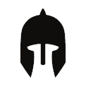
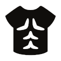
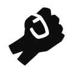

# Gloomhaven Rule Book
An inofficial light-weight, searchable copy of the rule book.

# Play Overview

The following section will teach you the mechanics for playing through an individual scenario, using the first one in the Scenario Book, **Black Barrow**, as an example.

**Standard Attack Modifier Deck**

**THE PLAY AREA INCLUDES:**

- A modular board of map tiles (a), constructed in a specific configuration using the Scenario Book as a reference (see Scenario Setup on pp. 12–13 for details). The map tiles should be laid out with doors (b) connecting them. The configuration of overlay tiles and monsters for the first room (c) should also be set up along with the character figures.
- A character mat for each player (d) and the corresponding hand of ability cards for that character’s class (e), health and experience trackers (f), character tokens (g), a facedown battle goal card (h), and any equipped item cards (i).
- All monster statistic cards (j), with their corresponding standees, and monster ability cards (k) set to one side in individual shuffled decks.
- Shuffled decks of attack modifier cards for each player (l) and one for the monsters (m). **A standard attack modifier deck consists of twenty cards as shown at the top of the page**, not the characterspecific modifier cards found in the character boxes. A deck, however, may be modified by level-up bonuses, items, scenario effects, and the effects of the CURSE and BLESS conditions.
- Piles of damage tokens (n), money tokens (o), and condition tokens (p).
- The elemental infusion table (q) with all six elements set in the “Inert” column.

## Character Mats

When a player begins their journey with the game, he or she will select one of the available character classes to play. Only one copy of each character class can be played in any given scenario. Each class has a unique set of abilities, so this is an important decision to make. When the box is first opened, the Brute , Tinkerer , Spellweaver , Scoundrel , Cragheart , and Mindthief  are available.

Once a character class has been chosen, the player takes the corresponding character mat, character tokens, and that character’s starting hand of Level 1 ability cards from the larger tuck box containing the character’s symbol, as well as the miniature contained in the smaller character tuck box.

**A CHARACTER MAT INCLUDES:**

- A portrait (a), icon (b), and name (c) of the class.
- Indicators of the maximum hit points at each level (d) of the class. Players should use tracking dials (e) to track their hit points (f) and experience (g) during a scenario.
- The maximum number of ability cards the class can take into battle (h).
- A short reference (i) for the round structure.
- Designations along the border (j) for where to place **discarded**, **lost**, and **active** cards.
- The reference number of the event cards (k) added to each deck when the character class is unlocked (not present on the six starting classes) and of event cards (l) added the first time the character class retires (see Announcing Retirement on p. 48 for details). These reference numbers apply to both city and road event decks.

## Character Ability Cards

Playing ability cards is what allows a character to perform **actions** in a scenario. Each round players choose two ability cards and use the **top action** of one card and the **bottom action** of the other card, resulting in two **actions** for each player on his or her turn. All ability cards are specific to a character class and are acquired when starting a new character or by leveling up.

**AN ABILITY CARD INCLUDES:**

- The name of the ability (a).
- An initiative number (b). The initiative number of the leading card played determines a player’s order in the initiative of a given round (see Determining Initiative on p. 18 for more details).
- The level of the class card (c). A character starting at Level 1 can only use their Level 1 cards (or, alternately, Level X cards), but a character gains more powerful cards as they level up to add to their pool of available ability cards.
- A top action (d) and bottom action (e). When the two ability cards are played on a player’s turn, one is used for the top action and the other for the bottom action. Note that a single **action** can contain several separate **abilities** (f). (See Character Turn on pp. 18–28 for more details on character actions.)

## Item Cards

Item cards are acquired by spending gold in between scenarios or looting specific treasure tiles. All item cards a character equips will be placed below his or her character mat and can be used during a battle to augment his or her abilities. Item cards are not class-specific, so any character can use any item. However, characters are limited in the number of items they can **equip** (bring into a scenario). Each character can equip only one  item, one  item, one  item, up to two  items **OR** one  item, and up to a number of  equal to half their level, rounded up. **Characters cannot own more than one copy of any item card.**

Head | Body | Legs | One Hand | Two Hands | Small Item
-----|------|------|----------|-----------|-----------
 |  |  |  |  | 

**AN ITEM CARD INCLUDES:**

- The name of the item (a) and the amount of gold a character must pay to acquire the item from the shop (b).
- What happens to the card after it is used (c). 
  - This symbol  means the item is **spent** after use, which is denoted by rotating the card to its side. Spent cards can be refreshed when a character performs a long rest (see Resting on p. 17 for more details). Sometimes an item is used multiple times before it is spent or consumed. This is depicted by use slots (d) on the card and can be tracked using a character token. 
  - This symbol  (not pictured) means the item is **consumed** after use, which is shown by flipping the card facedown. Consumed cards can only be refreshed **during a scenario** by specific abilities. **All items are refreshed between scenarios.** No item can be permanently consumed. 
  - If a card depicts neither of these symbols, there are no restrictions on the number of times it can be used during a scenario, other than what is written in the text of the card.
- When the item can be used and the bonus gained by the character when the item card is used (e).
- The equip slot (Head, Body, Legs, One Hand, Two Hands, Small Item) the item occupies (f).
- Some equipped items add a number of  cards to the equipping character’s attack modifier deck at the start of a scenario. If this is the case, the number of modifier cards is specified on the item (g).
- A count of how many of this item are in the game (h) and where this card lies within that count (i).
- Reference number for the item (j), which is on the back of the card.